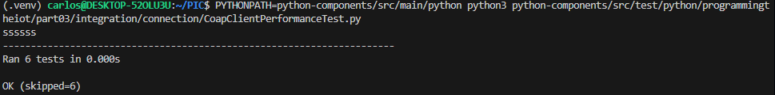
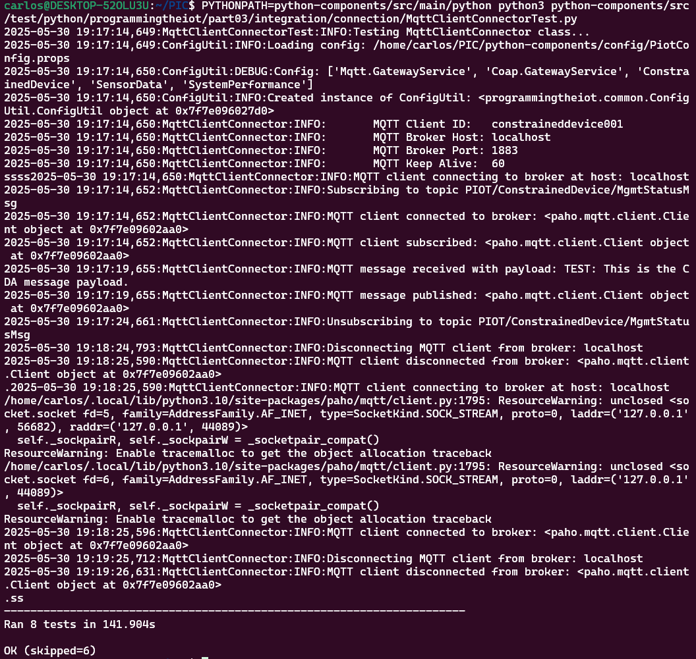
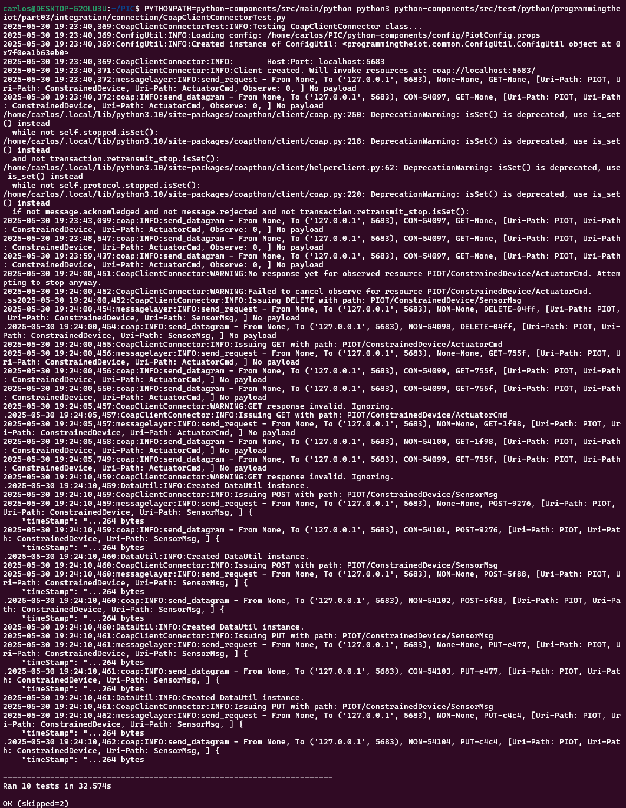

# Constrained Device Application (Connected Devices)

## Lab Module 09

Be sure to implement all the PIOT-CDA-* issues (requirements) listed.

### Description

NOTE: Include two full paragraphs describing your implementation approach by answering the questions listed below.

What does your implementation do?

La implementación consiste en un cliente CoAP capaz de enviar y recibir mensajes mediante los métodos GET, POST, PUT y DELETE. Asimismo, incluye soporte para la observación de recursos, lo que permite recibir actualizaciones automáticas desde el servidor CoAP.

How does your implementation work?

Para la implementación se utilizó la librería CoAPthon, mediante la cual se desarrolló un cliente CoAP que se comunica con el GDA. Este cliente construye rutas hacia los recursos, envía solicitudes GET, POST, PUT y DELETE, y procesa las respuestas recibidas. Además, soporta la observación de recursos, notificando los cambios a través de un listener que integra dichos datos en el sistema. Su correcto funcionamiento fue verificado mediante análisis con Wireshark.

### Code Repository and Branch

NOTE: Be sure to include the branch.

URL: <https://github.com/CarlosCarballido/python-components/tree/labmodule-9>

### Unit Tests Executed

NOTE: The instructor will execute your unit tests. You only need to list each test case below
(e.g. ConfigUtilTest, DataUtilTest, etc). Be sure to include all previous tests, too,
since you need to ensure you haven't introduced regressions.

- ConfigUtilTest.py
- SystemCpuUtilTaskTest.py
- SystemMemUtilTaskTest.py
- ActuatorDataTest.py
- SensorDataTest.py
- SystemPerformanceDataTest.py
- HumiditySensorSimTaskTest.py
- PressureSensorSimTaskTest.py
- TemperatureSensorSimTaskTest.py
- HumidifierActuatorSimTaskTest.py
- HvacActuatorSimTaskTest.py
- Unit tests part02

### Integration Tests Executed

NOTE: The instructor will execute most of your integration tests using their own environment, with
some exceptions (such as your cloud connectivity tests). In such cases, they'll review
your code to ensure it's correct. As for the tests you execute, you only need to list each
test case below (e.g. SensorSimAdapterManagerTest, DeviceDataManagerTest, etc.)

- ConstrainedDeviceAppTest.py
- SystemPerformanceManagerTest.py
- SensorAdapterManagerTest.py
- ActuatorAdapterManagerTest.py
- DeviceDataManagerNoCommsTest.py
- SenseHatEmulatorQuickTest.py
- HumidityEmulatorTaskTest.py
- PressureEmulatorTaskTest.py
- TemperatureEmulatorTaskTest.py
- HumidifierEmulatorTaskTest.py
- HvacEmulatorTaskTest.py
- LedDisplayEmulatorTaskTest.py
- SensorEmulatorManagerTest.py
- ActuatorEmulatorManagerTest.py
- DataIntegrationTest.py
- MqttClientConnectorTest.py
- CoapClientConnectorTest.py

