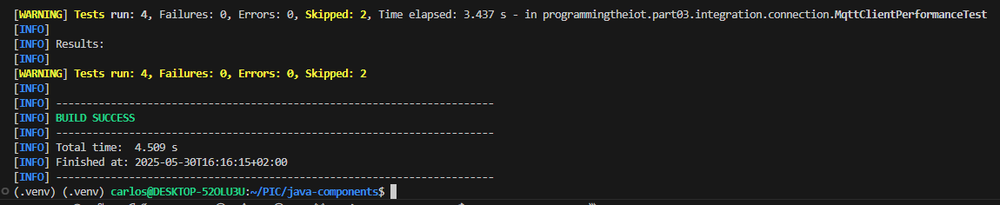
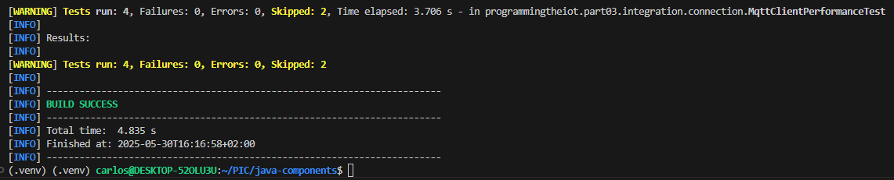
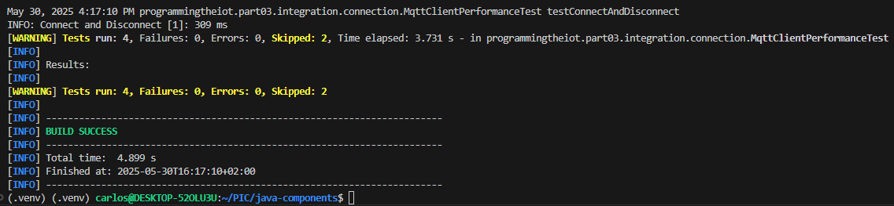
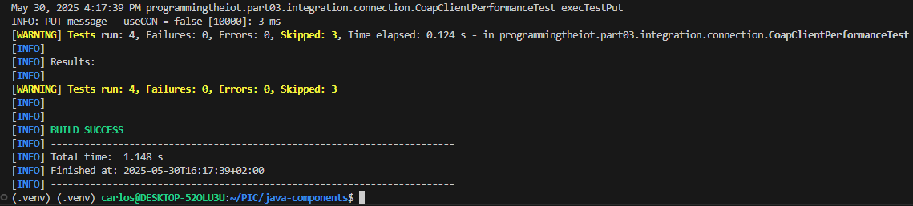
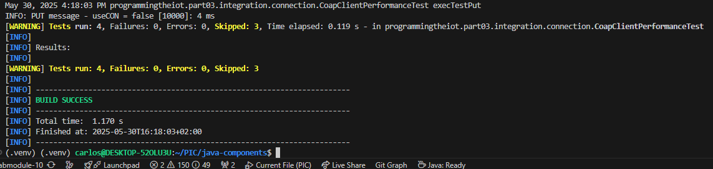
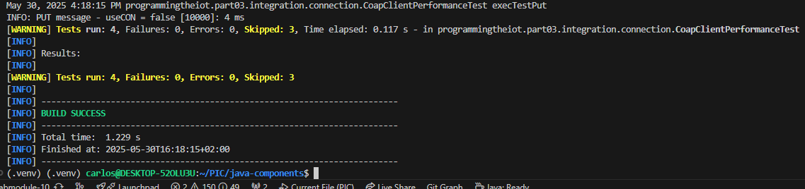

# Constrained Device Application (Connected Devices)

## Lab Module 10

Be sure to implement all the PIOT-CDA-* issues (requirements) listed.

### Description

NOTE: Include two full paragraphs describing your implementation approach by answering the questions listed below.

What does your implementation do? 

La implementación posibilita que el CDA se comunique de manera segura con el GDA mediante MQTT cifrado con TLS. Se soporta tanto el envío de datos (sensores, rendimiento y actuadores) como la recepción de comandos remotos para controlar el humidificador. Además, incorpora lógica local que activa el sistema HVAC en función de la temperatura detectada.

How does your implementation work?

La implementación utiliza tls_set junto con certificados generados mediante OpenSSL para establecer una conexión MQTT segura con TLS. Cuando se reciben datos del GDA, el cliente MQTT los procesa, DeviceDataManager los transforma en objetos ActuatorData, y ActuatorDataManager actualiza el humidificador conforme a las indicaciones recibidas. Además, se incorporó lógica local que activa el sistema HVAC en función de la temperatura.

### Code Repository and Branch

NOTE: Be sure to include the branch.

URL: <https://github.com/CarlosCarballido/python-components/tree/labmodule-10>

### Unit Tests Executed

NOTE: The instructor will execute your unit tests. You only need to list each test case below
(e.g. ConfigUtilTest, DataUtilTest, etc). Be sure to include all previous tests, too,
since you need to ensure you haven't introduced regressions.

- ConfigUtilTest.py
- SystemCpuUtilTaskTest.py
- SystemMemUtilTaskTest.py
- ActuatorDataTest.py
- SensorDataTest.py
- SystemPerformanceDataTest.py
- HumiditySensorSimTaskTest.py
- PressureSensorSimTaskTest.py
- TemperatureSensorSimTaskTest.py
- HumidifierActuatorSimTaskTest.py
- HvacActuatorSimTaskTest.py
- unit tests part02

### Integration Tests Executed

NOTE: The instructor will execute most of your integration tests using their own environment, with
some exceptions (such as your cloud connectivity tests). In such cases, they'll review
your code to ensure it's correct. As for the tests you execute, you only need to list each
test case below (e.g. SensorSimAdapterManagerTest, DeviceDataManagerTest, etc.)

- ConstrainedDeviceAppTest.py
- SystemPerformanceManagerTest.py
- SensorAdapterManagerTest.py
- ActuatorAdapterManagerTest.py
- DeviceDataManagerNoCommsTest.py
- SenseHatEmulatorQuickTest.py
- HumidityEmulatorTaskTest.py
- PressureEmulatorTaskTest.py
- TemperatureEmulatorTaskTest.py
- HumidifierEmulatorTaskTest.py
- HvacEmulatorTaskTest.py
- LedDisplayEmulatorTaskTest.py
- SensorEmulatorManagerTest.py
- ActuatorEmulatorManagerTest.py
- DataIntegrationTest.py
- MqttClientConnectorTest.py
- CoapClientConnectorTest.py
- DeviceDataManagerIntegrationTest.py

EOF.

