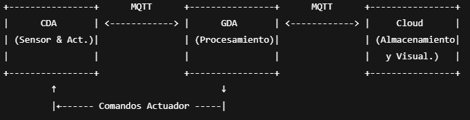

# Lab Module 12 - Semester Project Proposal

## Description

Describe your idea in 1 paragraph (at least 2 or 3 sentences).

Mi proyecto consiste en desarrollar un sistema de monitoreo y control basado en IoT que detecta la presencia de gases invisibles en diferentes entornos mediante sensores simulados. Utilizando protocolos como MQTT y CoAP, el sistema permite la comunicación bidireccional entre dispositivos (CDA y GDA) y la nube, facilitando el envío de datos en tiempo real y la activación automática de actuadores, como ventiladores, para mitigar riesgos. Esta solución busca mejorar la seguridad y la prevención en espacios industriales y domésticos mediante una arquitectura eficiente y escalable.

## What - The Problem 

What problem are you trying to solve and why does it matter? Write 1 to 2 paragraphs in response.

Este proyecto se centra en mitigar el peligro que representan los gases invisibles, los cuales pueden filtrarse en diferentes ambientes sin ser detectados fácilmente por las personas. La ausencia de detección temprana de estos gases puede provocar situaciones de riesgo significativo para la salud y la seguridad, incluyendo intoxicaciones, explosiones o daños ambientales.

Por ello, es fundamental contar con un sistema capaz de identificar la presencia de estos gases de manera rápida y confiable, permitiendo una respuesta inmediata para minimizar impactos negativos. Esta solución contribuye a proteger tanto a las personas como a las infraestructuras, mejorando la prevención y gestión de riesgos en entornos vulnerables.

## Why - Who Cares? 

Why do you care about this particular problem? Write 1 to 2 paragraphs in response.

Este problema me importa porque las fugas de gases en ambientes industriales o de trabajo representan riesgos significativos para la seguridad de las personas y la integridad de las instalaciones. La detección temprana es fundamental para evitar accidentes graves, intoxicaciones o daños materiales que pueden tener consecuencias fatales o económicas importantes.

Además, la automatización en la detección y respuesta ante estas fugas contribuye a minimizar errores humanos y garantiza una reacción rápida y precisa, lo que mejora la prevención y protege tanto a los trabajadores como al medio ambiente. Por estas razones, desarrollar un sistema efectivo en este ámbito es crucial para promover entornos más seguros y confiables.

## How - Expected Technical Approach

How do you plan to tackle this problem technically?

Include a high-level design diagram depicting your planned technical approach - it does not need to be final, but it must include the CDA, GDA, and cloud services you plan to use, as well as the protocol(s) you will use for communicating between the devices and the cloud.

Write 1 to 2 paragraphs describing your diagram.

La solución técnica consiste en desarrollar un emulador de sensor de gases que genere lecturas simuladas pero realistas, acompañado de un actuador que represente un ventilador. Este actuador se activa automáticamente cuando los niveles de gas superan un umbral predefinido.

En este diseño, el Constrained Device Application (CDA) es responsable de generar y enviar los datos del sensor mediante MQTT al Gateway Device Application (GDA). El GDA analiza esta información y, si es necesario, envía comandos para controlar el ventilador. Además, tanto los datos del sensor como el estado del actuador se transmiten a una plataforma en la nube (Ubidots) para almacenamiento, visualización y análisis posterior. La comunicación segura se garantiza mediante el uso de protocolos como MQTT sobre TLS.

## Results - Expected Outcomes 

If your project is successful, what outcome do you expect (e.g. what will happen if everything works)? Write 1 to 2 paragraphs describing your expected outcomes.

El sistema podrá generar lecturas simuladas de gases, procesarlas de forma adecuada y activar el ventilador cuando los niveles detectados superen el umbral establecido. Se espera que el flujo de datos, desde el sensor simulado hasta la plataforma en la nube, se realice de manera continua y sin fallos.

Además, los datos estarán disponibles en tiempo real en la nube, permitiendo la supervisión remota de la presencia de gases en el ambiente. Esto facilitará verificar que el sistema automatizado de ventilación responde de forma eficaz ante situaciones de riesgo, asegurando la seguridad del entorno monitoreado.

EOF.
